# PsiTerm and PsiMail

**Bringing a 1999 Psion Series 5mx into 2026:** SSH, modern IMAP email with
TLS and two-way calendar sync, as native EPOC apps for a 36 MHz palmtop.

> **Alpha - pre-v1. Expect bugs!** The apps are new and changing fast. They
> work well enough for daily SSH, tmux, Claude Code and email on a real 5mx,
> but things will break. Bug reports (a photo of the screen is perfect) are
> very welcome via [GitHub issues](https://github.com/danieledge/psiterm/issues).

[](https://github.com/danieledge/psiterm/raw/main/dist/PsiTerm.sis)
[](https://github.com/danieledge/psiterm/raw/main/dist/PsiMail.sis)
[](https://buymeacoffee.com/danedge)

<p align="center">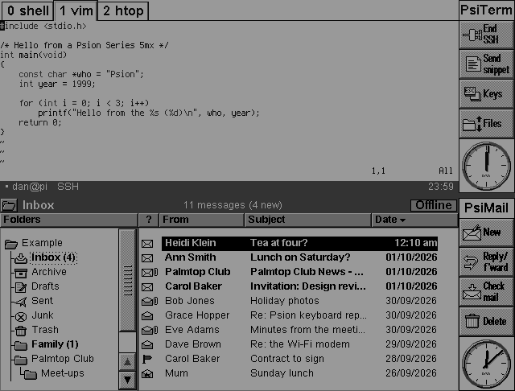</p>

| App | What it is | Version | More |
|---|---|---|---|
| **PsiTerm** | An SSH terminal (xterm-256color) on a port of Dropbear: tmux, vim, htop and Claude Code on a palmtop, with file transfer | 0.73 | [below](#psiterm) |
| **PsiMail** | Email for any IMAP/SMTP server with TLS (made for Fastmail), and a calendar that keeps the Agenda in step with CalDAV | 0.74 | [mail/README.md](mail/README.md) |

Both apps look and behave like the Psion's own programs - EIKON toolbars,
menus, dialogs and shortcuts, following Symbian's *EIKON Application Style
Guide* - and they share one connection layer: a Wi-Fi modem on the serial
port (`ATDT host:port`) or the Psion's own dial-up TCP/IP. Modern servers
work: curve25519, Ed25519, ChaCha20-Poly1305 and TLS 1.3, all on the Psion's
ARM710.

## Contents

- [Screenshots](#screenshots)
- [What's new](#whats-new)
- [PsiTerm](#psiterm) · [PsiMail](#psimail)
- [Installing](#installing)
- [Connecting](#connecting)
- [Updates](#updates)
- [Building from source](#building-from-source)
- [Support](#support) · [Licence and credits](#licence-and-credits)

## Screenshots

Taken in a Series 5mx emulator at the Psion's own 640x240 resolution. Tap or
click one to see it full size.

**PsiTerm**

<table>
<tr>
<td><a href="docs/screenshots/psiterm-ssh.png">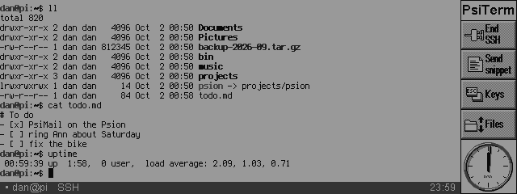</a><br>An SSH session</td>
<td><a href="docs/screenshots/psiterm-tmux-tabs.png">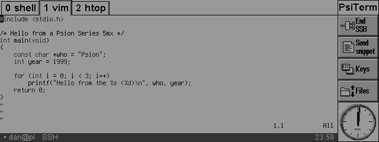</a><br>tmux windows as tabs</td>
</tr>
<tr>
<td><a href="docs/screenshots/psiterm-files.png">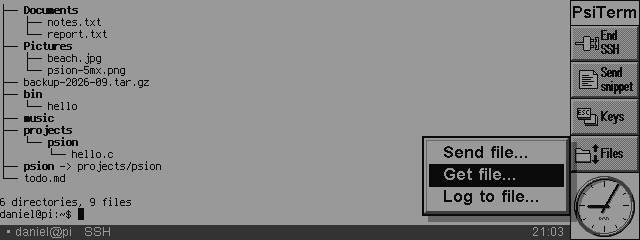</a><br>The toolbar's Files pop-out</td>
<td><a href="docs/screenshots/psiterm-get-file.png">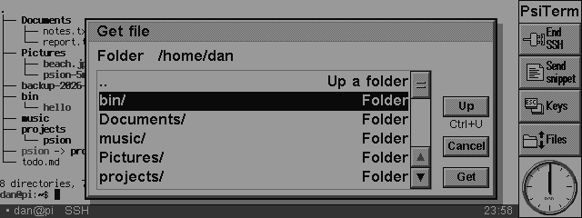</a><br>Get file (SFTP)</td>
</tr>
<tr>
<td><a href="docs/screenshots/psiterm-file-menu.png">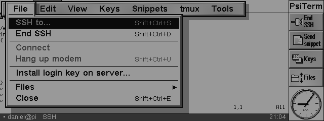</a><br>The File menu</td>
<td><a href="docs/screenshots/psiterm-test.png">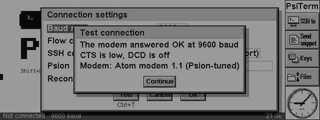</a><br>Connection settings > Test</td>
</tr>
</table>

**PsiMail**

<table>
<tr>
<td><a href="docs/screenshots/psimail-mailbox.png">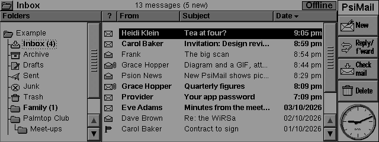</a><br>Folders and messages</td>
<td><a href="docs/screenshots/psimail-reader.png">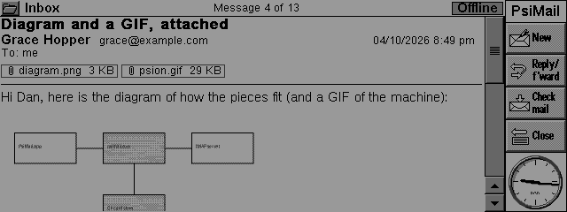</a><br>A message with a picture</td>
</tr>
<tr>
<td><a href="docs/screenshots/psimail-newsletter.png">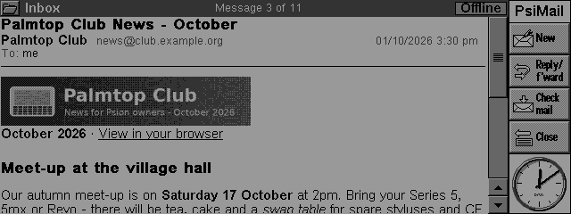</a><br>An HTML newsletter</td>
<td><a href="docs/screenshots/psimail-invitation.png">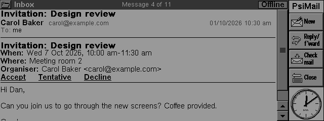</a><br>An invitation</td>
</tr>
<tr>
<td><a href="docs/screenshots/psimail-calendar-week.png">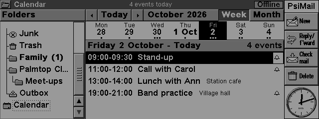</a><br>The calendar: week</td>
<td><a href="docs/screenshots/psimail-calendar-month.png">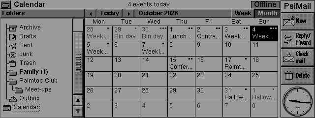</a><br>The calendar: month</td>
</tr>
<tr>
<td><a href="docs/screenshots/psimail-contacts.png">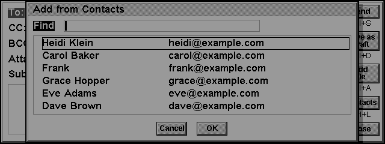</a><br>Addresses from Contacts</td>
<td><a href="docs/screenshots/psimail-preferences.png">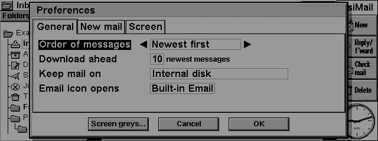</a><br>Preferences</td>
</tr>
</table>

More PsiMail screenshots are in [mail/README.md](mail/README.md).

## What's new

**PsiTerm 0.73**
- A **Files** button on the toolbar pops up Send file, Get file and Log to
  file. Zoom stays on the sidebar's zoom icons and in the View menu.
- **tmux windows as tabs**, drawn as EIKON's own dialog page tabs in place of
  tmux's status line: tap one to switch, Ctrl+Tab for the next.

**PsiMail 0.74**
- A **new message header**: the subject in large bold type, the sender and
  date, To and Cc on one line, and the attachments as chips you tap to open.
- **Pictures from the web only when you ask** ("Show them"), as first-party
  mail programs do; tracking pixels are never fetched.
- **Newsletters without the empty space**: hidden preheaders, spacers and
  empty cells are left out.
- **Quiet progress**: one busy message per job and one outcome, with every
  step still available (Preferences > New mail > Show detailed progress).
- The mail engine stays up when a busy program holds the Psion, and starts
  again by itself if it stops. Help has a scroll bar.

**Recently**
- PsiTerm 0.72: file transfer over SFTP and a session log.
- PsiMail 0.73: Undo, printing, new-mail alerts and a timed check,
  invitations into the Agenda, contact cards into Contacts, progressive JPEG,
  File > Save as Word file.
- PsiMail 0.72: the **Email icon** below the screen can open PsiMail.
- Both: a **Test** button in Connection settings.

## PsiTerm

A native EPOC terminal (libvterm-based, xterm-256color) wrapping a port of the
**Dropbear SSH** client. It connects through anything that behaves like a
Hayes modem on the serial port - for example a Wi-Fi RS-232 modem - by
dialling `ATDT host:port`, or over the Psion's own dial-up (PPP) TCP/IP stack.

Modern servers work: curve25519 key exchange, Ed25519/RSA host keys,
chacha20-poly1305, zlib compression. It is fast enough to run tmux, vim, htop -
and Claude Code - on a 1999 palmtop.

- SSH with saved servers and (optionally) saved passwords; a block-drawn
  start screen
- SSH keys (Tools > SSH keys): make Ed25519 keys on the Psion or import
  your own (OpenSSH or Dropbear, Ed25519 or RSA), each named, with its
  fingerprint; show, rename, regenerate or delete them. File > Install
  login key on server adds one to a server, and each saved server chooses its
  key, a saved password, or to ask
- File transfer over the logged-in connection (SFTP, no second login):
  File > Send file picks a Psion file with the standard Open file dialog,
  then a folder on the server; File > Get file browses the server's
  folders (names and sizes) and saves with the standard Save as dialog.
  Progress with Stop; works over a 57600 baud modem; a stopped or failed
  download leaves no half file. Servers without SFTP are told apart
- Session log (File > Log to file): everything received, as plain text
  (escape sequences taken out) or raw, to a file you choose; "Log" on the
  status line while it runs
- Snippets: your own commands and prompts on a menu and on Shift+Ctrl
  hotkeys, with escapes for any key sequence (`\n`, `^C`, `\e`)
- tmux windows shown as tabs, drawn as EIKON's dialog page tabs at the top of
  the screen in place of tmux's status line: tap one to switch, Ctrl+Tab /
  Shift+Ctrl+Tab for the next / previous, arrows at the ends when there are
  many. Read from tmux's status line, or exactly from tmux itself after
  tmux > Set up tabs on this server
- Claude Code keys (interrupt, rewind, switch mode, /clear, /compact...) and a
  tmux menu (windows, splits, panes, zoom, scroll mode, detach)
- Themes (classic, inverted, high contrast, soft), cursor styles, and a status
  line with the connection state and clock
- Auto-reconnect when a session drops (Psion switched off, Wi-Fi gone), with an
  optional per-server command on login such as `tmux new -A -s psion` to land
  back where you were
- Terminus font in four sizes (plus Courier), optional bold, 16 greys
- The standard EIKON toolbar: SSH to (End SSH while connected), then the Send
  snippet, Keys and Files pop-ups (Files: Send file, Get file, Log to file),
  and the clock. The sidebar's zoom icons zoom the terminal (as View > Zoom
  in / Zoom out). View > Show toolbar (Shift+Ctrl+B)
  hides it and the terminal takes the full width - 106 columns instead of 95
  in Terminus 12, 80 instead of 71 in Terminus 14/16, 64 instead of 57 in
  Terminus 18 - with the server told to reflow, even mid-session; remembered
- Stylus as a mouse when a program asks for one (tmux with mouse on, vim,
  htop): tap to click - panes, tmux windows, buttons - and drag up or down to
  scroll. Shift+stylus still selects text
- Scrollback, pen selection, copy/paste with the system clipboard
- Box drawing, block and Braille graphics drawn natively
- Tools > Help on PsiTerm (Shift+Ctrl+H)
- Signed over-the-air updates straight from GitHub (TLS 1.3 on a 36 MHz ARM)
- An on-device crypto speed test (Tools > Debug)

## PsiMail

An email client made to replace the built-in Email program, for Fastmail or
any IMAP/SMTP server with TLS, with the server's certificate checked. The full
feature list, keys and settings are in [mail/README.md](mail/README.md).

- Laid out like the built-in Email program: a folder tree with unread counts,
  a message list with unread messages in bold, a rich-text reader, the
  standard toolbar, and File / Edit / Message / View / Tools menus
- HTML mail as rich text, pictures (JPEG, PNG and GIF, decoded on the
  Psion), attachments opened in their own programs
- Write with bold, italic and underline; addresses from Contacts; files
  attached; drafts; Undo for deletes, moves and archives; Print; Save as
  Word file
- Folders: create, rename, delete, move, archive; search on the server;
  work offline and send later; up to 4 accounts
- Invitations: Accept, Tentative or Decline, into the Agenda, with a reply to
  the organiser; contact cards into Contacts
- A calendar with week and month views, and two-way sync between the
  Psion's Agenda and a CalDAV server such as Fastmail's
- New-mail alerts and a timed check; the Email icon below the screen can
  open PsiMail

A web browser for the Psion is in development on the `dev` branch. It is not
part of the stable release yet, because it does not work yet.

## Installing

1. **Download** the apps you want from `dist/`:
   [PsiTerm.sis](https://github.com/danieledge/psiterm/raw/main/dist/PsiTerm.sis),
   [PsiMail.sis](https://github.com/danieledge/psiterm/raw/main/dist/PsiMail.sis)
   (always the latest versions - see `dist/version.txt` and
   `dist/PsiMail-version.txt`).
2. **Copy** them to the Psion: the easiest way is a **CF card** in a PC card
   reader (for example into `D:\Install\`), or PsiWin.
3. **Open** each .sis on the Psion and install to **D:** (the CF card) if you
   have one. The apps appear on the Extras bar.

Each installer also offers the EPOC "Standard C Library" (ESTLIB.DLL), which
the apps need and the 5mx ROM lacks - say OK if asked. Installing a newer
version replaces the old one. Removing PsiMail leaves your mail where it
is: it is yours.

After that the apps **update themselves over the air**: Tools > Update
PsiTerm (or Update PsiMail) fetches the newest signed release from GitHub -
see [Updates](#updates).

Then, in PsiTerm: Tools > Connection settings (see below), and SSH to
(Shift+Ctrl+S) > New for your first server. In PsiMail the account dialog opens
by itself the first time. `docs/FIRSTRUN.TXT` is a step-by-step first run
with a WiRSa modem, written for PsiTerm 0.35 (some menu names have changed
since).

## Connecting

Both apps share one set of connection settings (Tools > Connection
settings in any of them). The serial port can be used by one program at a
time, so the Psion's **Remote link must be off** (Ctrl+L on the System
screen), and only one app uses the modem at once - File > Disconnect or Hang
up frees it.

**Test** (Ctrl+T) in Connection settings tries the settings shown, before OK:
for a modem, whether it answers and at what baud rate, CTS and DCD, the
modem's name, and whether RTS/CTS will work; for Psion Internet, whether the
connection is up and names can be looked up (it asks before dialling).

- **Psion Internet (PPP)**: the Psion's own dial-up TCP/IP, set up in the
  Control panel's Internet and Modems settings - a phone or a PPP server. The
  apps start it when they need it and the Psion's connection dialogs appear.
- **A Wi-Fi serial modem** such as a WiRSa or a WiFi232: the apps dial
  `ATDT host:port` and talk through the connection the modem makes. Set the
  baud rate to the modem's; 115200 with RTS/CTS flow control is fastest if
  the cable carries those lines, otherwise choose None.
- **Atom modem firmware** for an M5Stack Atom is in development on the `dev`
  branch. It has not been tested on hardware yet, so it is not released here.

## Updates

Tools > Update PsiTerm and Update PsiMail ask where to look
(GitHub, its test builds, or a local server), download the newest release
over the same modem or dial-up link, check it and offer to install it.

The Psion speaks a minimal TLS 1.3 client (`ssh/tls13.c`: X25519,
ChaCha20-Poly1305). Every release is signed with Ed25519, and each app checks
the signature against the release key built into it before installing
anything - so updates are trustworthy from GitHub or anywhere else. How
releases are made and signed is in [docs/BUILDING.md](docs/BUILDING.md#updates-and-signing).

## Building from source

You need Linux, wine, and the EPOC R5 C++ SDK with the gcc 3.0 Psion
toolchain ([psion_cpp_sdk_linux](https://github.com/static-void/psion_cpp_sdk_linux)).

```sh
PSION_SDK=/path/to/psion_cpp_sdk_linux ./build.sh        # dist/PsiTerm.sis
PSION_SDK=/path/to/psion_cpp_sdk_linux mail/build.sh     # dist/PsiMail.sis
```

[docs/BUILDING.md](docs/BUILDING.md) has the details, the source layout and
the release steps; [mail/README.md](mail/README.md#how-it-works) explains how
PsiMail is put together.

## Support

If the apps bring your Psion back to life and you'd like to say thanks,
you can [buy me a coffee](https://buymeacoffee.com/danedge).

## Licence and credits

MIT for the project's own code - see `LICENSE`. Bundled components keep their
own licences - see [`THIRD-PARTY.md`](THIRD-PARTY.md): Dropbear SSH (with
LibTomCrypt, LibTomMath and TweetNaCl), libvterm, zlib, picojpeg, the
Terminus font, and - for the web browser in development in `web/` only -
NetSurf and its libraries, which make `psiweb.exe` GPL v2.

(c) Dan Edge
