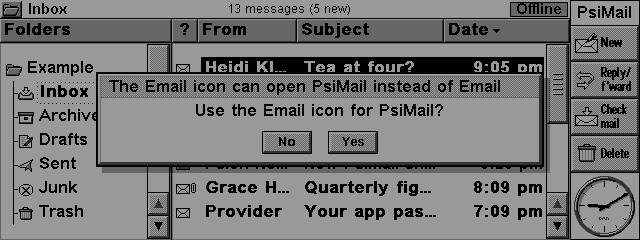

# PsiMail

Email and a calendar for the **Psion Series 5mx**, made to replace the
built-in Email program. PsiMail reads and sends mail through any IMAP/SMTP
server with TLS - it is made for Fastmail - with the server's certificate
checked, and keeps the Psion's own Agenda in step with Fastmail's calendars
(any CalDAV server). It uses PsiTerm's networking - a Wi-Fi modem such as the
WiRSa (`ATDT host:port`) or the Psion's own dial-up TCP/IP - and PsiTerm's
TLS 1.3 client.

**Status: 0.74, alpha.** The engine has been run against Dovecot, Radicale
and Fastmail both as PC code and as the exact ARM code in an emulator, and the
EIKON app is driven screen by screen in a 5mx emulator. Expect bugs, and
please report them via [GitHub issues](https://github.com/danieledge/psiterm/issues).

## Contents

- [Screenshots](#screenshots)
- [What it does](#what-it-does)
- [Setting up Fastmail](#setting-up-fastmail)
- [Settings](#settings)
- [Connections](#connections)
- [The calendar](#the-calendar)
- [Privacy](#privacy)
- [Keys](#keys) and [writing a message](#writing-a-message)
- [Updating from the Psion](#updating-from-the-psion)
- [Troubleshooting](#troubleshooting)
- [How it works](#how-it-works), [Security](#security), [Building](#building), [Files on the card](#files-on-the-card)
- [Not yet](#not-yet)

## Screenshots

<table>
<tr>
<td> The reader: header and a picture</td>
<td> An HTML newsletter</td>
</tr>
<tr>
<td> An invitation</td>
<td> Addresses from Contacts</td>
</tr>
<tr>
<td> The calendar: week</td>
<td> The calendar: month</td>
</tr>
<tr>
<td><a href="../docs/screenshots/psimail-preferences.png"> Preferences, the General page" width="400"></a> Preferences</td>
<td> The Email icon question</td>
</tr>
</table>

## What it does

**Laid out like the built-in Email program**, from EIKON's own parts:

* A title band (account\\folder, how many messages or what's happening, the
  connection), column headings (? / From / Subject / Date) you tap to sort,
  a folder tree with pictures, status pictures in the message list, a
  read-only rich text reader with a scroll bar, the standard toolbar (New and
  Reply/f'ward pop up a choice, Check mail, Delete - or Close when reading),
  and View > Show toolbar / title bar / list of folders.
* Menus, shortcuts, wording and messages follow Symbian's EIKON Application
  Style Guide: standard shortcuts, busy messages bottom left, infoprints, a
  second tap opens, and zoom goes round three sizes like the built-in Email
  program. The menus are laid out as the built-in Email program's: File,
  Edit, Message (Event in the calendar), View, Tools. The pictures are
  original pixel art, made by `tools/mkicons.py` into PsiMail.mbm.
* Quiet progress: one steady busy message per job ("Checking mail...",
  "Sending...", "Getting message...") and one outcome ("2 new messages",
  "Sent", "No new mail"). Nothing for work PsiMail does by itself. Tools >
  Preferences > New mail > Show detailed progress shows every step again.
* Tools > Help on PsiMail (Shift+Ctrl+H): the help topics in a dialog with a
  scroll bar (see `app/pmhelp.cpp` for why not a .hlp file).

**Folders and messages**

* Folders with unread counts (bold while there is unread mail, as are the
  unread messages themselves); the newest 50 messages per folder (more with
  File > Folder > Get older messages), kept on the CF card to read offline.
* File > Folder > Create new / Rename / Delete (IMAP CREATE, RENAME and
  DELETE, with SUBSCRIBE; names go as modified UTF-7, the local files follow
  a rename). The Inbox and the standard folders stay as they are. These need
  the server, so offline they ask to go online.
* Delete (to Trash), archive, move to a folder, read/unread, flag.
  Edit > Undo (Ctrl+Z) puts back the last few deleted, moved or archived
  messages, from the server too (moved back from the Trash or the folder;
  a move still waiting offline is simply taken out of the queue): see
  `engine/undo.c`.
* Search a folder on the server (Edit > Find).
* Work offline: changes and new messages are kept and sent next time.
* Up to 4 accounts.

**Reading**

* The reader's header is part of the message, so it scrolls, zooms and
  prints with it: the subject bold and larger, the flag and unread pictures,
  the sender in bold with the address in grey and the date on the right, To
  and Cc on one smaller line ("To: me, Ann, +3 others" - a tap shows them
  all), and the attachments as chips (paperclip, name, size) that open on a
  tap or with Tab and Enter (`app/pmheader.cpp`).
* Message text downloaded when opened, up to 64 KB (the rest on request,
  Message > Get whole message), and the newest messages downloaded ahead
  after Check mail so they open at once.
* HTML mail is shown as rich text - headings, bold and italic, lists,
  quotes, links you can move to with Tab and open with Enter - and
  Message > Web > View as web page opens the original in a web browser, as
  do links. The browser is in development on the `dev` branch and is not in
  this release yet. Plain text gets its quotes and links shown the same way.
* HTML newsletters without the empty space: hidden preheaders, spacer
  cells and pictures, empty paragraphs and cells are left out, and blank
  lines come one at a time (`engine/html.c`).
* Pictures in messages, JPEG (baseline and progressive), PNG and GIF,
  decoded on the Psion to 16 greys in the background, so the screen stays
  live while a big one is set out. Pictures that come with the message up to
  300 KB are fetched with it; a bigger one shows its name and size, and a tap
  fetches it. Pictures on the web are fetched only when asked for - see
  [Privacy](#privacy).
* Attachments: Message > Attachments > Open opens one in its own program
  (Word, Sketch and so on); Save (Ctrl+S) puts it in
  `D:\Documents\Attachments\` (your files, so in your Documents).
* File > Save as Word file (Shift+Ctrl+S): the open message as a Psion Word
  file (header, text, bold/italic/underline, headings, lists), through the
  Word engine itself (CWordModel), so the built-in Word opens it.
* File > Printing: Page setup, Print setup, Print preview and Print
  (Ctrl+P), with EIKON's own dialogs, so any installed printer driver works
  (PsiWin's printing via the PC, serial, parallel, infrared). It prints the
  message as the reader shows it: the header lines, the text and its
  pictures (`app/pmprint.cpp`).

**Invitations and contact cards**

* Invitations (`text/calendar` or an `.ics` file, iTIP `METHOD:REQUEST`):
  the reader shows what, when (on the Psion's clock, whatever time zone the
  invitation was written in), where and who from at the top, with Accept,
  Tentative and Decline as links (Tab, Enter or a tap; also Edit >
  Invitation). Accept and Tentative put the event in the Agenda (and so on
  the CalDAV server, with calendar sync on); each answer goes to the
  organiser as an iTIP `METHOD:REPLY` through the Outbox. A cancellation
  (`METHOD:CANCEL`) offers Remove from Agenda.
* Contact cards (`text/vcard` / `.vcf`, vCard 2.1, 3.0 and 4.0): Add to
  Contacts puts the name, company, job title, phone numbers, email
  addresses, address and web page into the Contacts program's own fields
  (as its template labels them). Attach > Add my contact card sends yours.

**Writing**

* New message, reply, reply to all, forward (with or without the original's
  attachments: PsiMail asks); files from the Psion attached (up to 8). Sent
  as UTF-8; a copy saved to Sent.
* Bold, italic and underline in the text (sent as HTML with a plain text
  copy); a signature from the account settings.
* Addresses from the Psion's Contacts: type the start of a name and press
  Tab, or the Contacts button (Ctrl+L) to pick several. Edit > Add to
  Contacts > Sender adds the sender of a message.
* Drafts are kept in the Outbox to finish later.

**New mail and the Email icon**

* New mail: a beep and an infoprint ("2 new messages", over any program
  when PsiMail is in the background); an optional timed check of the Inbox
  every 10, 15, 30 or 60 minutes while PsiMail runs (only while connected,
  or connecting); messages waiting in the Outbox go when a connection comes
  up or Work offline is turned off. Tools > Preferences > New mail
  (`app/pmauto.cpp`).
* The Email icon below the screen can open PsiMail instead of the built-in
  Email program: PsiMail asks once after it is installed, and Tools >
  Preferences > Email icon opens (PsiMail / Built-in Email) changes it.
  Built-in Email, or removing PsiMail, gives the icon back to the built-in
  program (see `button/` below).

**Calendar**: two-way sync between Fastmail's calendars and the Psion's
Agenda, and a week and month view of its own (see [below](#the-calendar)).

## Setting up Fastmail

1. On fastmail.com: Settings > Privacy & Security > Manage app passwords >
   New app password, with access to "Mail, Contacts & Calendars" (or
   IMAP/SMTP only if you don't want the calendar). Gmail and Outlook have
   app passwords too, under their security settings, once two-step
   verification is on.
2. Install `dist/PsiMail.sis`, start PsiMail. The account dialog starts
   with Fastmail's servers filled in (imap.fastmail.com:993 and
   smtp.fastmail.com:465, both TLS): fill in your address and the app
   password. For another provider, type its servers and ports.
3. Tools > Connection settings: as for PsiTerm (modem or Psion TCP/IP, baud
   rate, flow control) - see [Connections](#connections).
4. Shift+Ctrl+C (Check mail) sends and receives. The first time PsiMail
   talks to a server it shows the server's key and asks whether to trust it.

If Fastmail already saves messages sent by SMTP in your Sent folder, set
"Copy to Sent folder" to No in the account settings to avoid two copies (and
save the upload time).

## Settings

**Tools > Accounts > Settings** (Add, Switch, Remove for more accounts):

| Page | Settings |
|---|---|
| Account | Account name, your name, email address, signature (`/` starts a new line) |
| Incoming | IMAP server, port, security (None, TLS (SSL), STARTTLS), user name, password |
| Outgoing | SMTP server, port, security, copy to Sent folder |
| Limits | messages per folder (50), text per message in KB (64) |

**Tools > Preferences** (Ctrl+K):

| Page | Setting | Choices |
|---|---|---|
| General | Order of messages | newest or oldest first, by sender, by subject, unread first |
| | Download ahead | how many of the newest messages' text to fetch after Check mail (0 = off) |
| | Keep mail on | the memory disk (CF card) if there is one, or the internal disk |
| | Show pictures | Yes, Only attached files, No |
| | Web pictures | Ask, Always, Never (see [Privacy](#privacy)) |
| | Email icon opens | PsiMail or Built-in Email |
| New mail | Alert for new mail | Sound & message, Message only, Off |
| | Check for new mail | Off, every 10, 15 or 30 minutes, every hour |
| | If not connected | Wait for a connection, or Connect |
| | Send waiting mail when connected | Yes, No |
| | Show detailed progress | every engine and link step, for finding connection problems |

**Tools > Calendar settings**: see [The calendar](#the-calendar).
**Tools > Connection settings**: see [Connections](#connections).

## Connections

Tools > Connection settings chooses how PsiMail reaches the Internet; the
settings are shared with PsiTerm.

* **Modem**: a serial Wi-Fi modem (such as a WiRSa or a WiFi232) on the Psion's serial port.
  PsiMail dials the server with `ATDT host:port`. Set the baud rate to the
  modem's; 115200 with RTS/CTS flow control is fastest if the cable carries
  those lines. The line is only taken while PsiMail needs it, and File >
  Disconnect (Ctrl+U) hangs up so PsiTerm can have it.
* **Psion Internet (PPP)**: the Psion's own dial-up connection, set up in the
  Control panel's Internet and Modems settings. PsiMail starts it when it
  needs to and the Psion's connection dialogs appear; PsiTerm shares it.
* **Test** (Ctrl+T) tries the settings shown, before OK: whether the modem
  answers and at what speed, CTS and DCD, the modem's name, and whether
  RTS/CTS will work; for Psion Internet, whether the connection is up and
  names can be looked up (it asks before dialling).

The serial port can be used by one program at a time, and the Remote link
must be off. Everything goes over TLS 1.3 (or STARTTLS, if the account says
so), with the certificate checked - see [Security](#security).

## The calendar

Tools > Calendar settings: turn "Sync with Agenda" on. The server is
caldav.fastmail.com (for another server give its address, with a path if
it needs one: `dav.example.com/cal/`). The mail password is used unless
you give another. Pick your time zone (PsiMail guesses from the Psion's
home city) and the Agenda file (normally `C:\Documents\Agenda`).

After that, Check mail (Shift+Ctrl+C) also syncs the calendar, or Event >
Sync calendar (Shift+Ctrl+Y, from anywhere) does just that. The Agenda can
stay open: PsiMail goes through the Agenda server as PsiWin does.

* Every event on your calendars from 30 days ago to 180 days ahead (both
  can be changed) becomes an Agenda entry: timed events as appointments,
  all-day ones as day entries, with their location and alarm.
* Events that repeat arrive as one entry per time. Change or delete one on
  the Psion and just that one changes on the server.
* Entries you add on the Psion go to the calendar chosen in the settings
  ("New entries go to", once the first sync has found your calendars).
  Entries already on the Psion stay there unless you choose
  "Copy to the server" before the first sync.
* Changes both ways; if an event changed on both sides, the server's
  version wins. Deleting on either side deletes on the other. Events that
  fall out of the window stay in the Agenda.
* The server keeps what the Psion doesn't show (descriptions, guests,
  other alarms): PsiMail changes only the fields it knows.

PsiMail has its own calendar too (Shift+Ctrl+N, View > Go to > Calendar,
or Calendar in the folder tree), drawn beside the folder tree with the
mail list's fonts, rows, zoom and colours: the week's seven days and the
chosen day's events (times, name, place; marks for an alarm, one of a
series, waiting to be sent; a line where "now" is), or the month with each
day's first event (Ctrl+Q switches). Today has a frame; the chosen day or
event is shown inverted, as EIKON's lists do. Enter (or a second tap) shows
an event in full; Event > Create new event (Ctrl+N) adds one through a
standard dialog (to the Agenda, and from there to the server). It shows what
has been synced, and new Psion entries waiting to be sent.

Not yet: repeating entries made on the Psion (they stay on the Psion), to-do
lists, anniversaries, more than one calendar account.

## Privacy

* **Pictures from the web are not fetched unless you ask.** A newsletter's
  pictures would tell the sender when, and where, you read it. A message
  with some says "Pictures from the web are not shown - Show them" at the
  top; Show them, or Message > Web > Show web pictures, fetches them for that
  message. Tools > Preferences > Web pictures: Ask (the default), Always or
  Never (`engine/webpics.c`, `app/pmwebpic.cpp`).
* Even when asked, PsiMail never fetches spacers or tracking pixels, sends
  no password with the pictures, and keeps to at most 16 pictures, 300 KB
  each. Working offline fetches nothing, and on the modem PsiMail says first
  how many calls it will take (each web site is a call of its own).
* Pictures sent with the message come from your own mail server with the
  message, not from the sender's web site (Tools > Preferences > Show
  pictures: Yes, Only attached files, or No).
* Passwords are kept scrambled, not encrypted, in
  `C:\System\Apps\PsiMail\PsiMail.ini` (and `Calendar.ini`): anyone with your
  Psion can use them.

## Keys

| | |
|---|---|
| Up/Down, Fn+Up/Fn+Down (Pg Up/Pg Dn), Fn+Left/Fn+Right (Home/End) | move / scroll |
| Enter or Right | open |
| Esc or Left | back (Esc stops a download while one is running) |
| Left/Right in a message | previous / next message |
| Tab / Shift+Tab in a message | next / previous link or attachment (Enter opens it) |
| Tab or Left in the message list | the folder column |
| Del (and Backspace in a list) | delete |
| Shift+Ctrl+C / Ctrl+U / Esc | check mail (send & receive) / disconnect / stop |
| Shift+Ctrl+W | work offline |
| Ctrl+N / Ctrl+R / Shift+Ctrl+R / Ctrl+W | new / reply / reply to all / forward |
| Ctrl+D / Ctrl+X / Shift+Ctrl+E | delete / move to folder / archive |
| Ctrl+Z | undo the last delete, move or archive |
| Ctrl+P / Shift+Ctrl+P / Shift+Ctrl+V | print / print setup / print preview |
| Shift+Ctrl+U / Shift+Ctrl+F | unread / flagged |
| Ctrl+S | save an attachment (Message > Attachments > Open / Save) |
| Shift+Ctrl+S | save the open message as a Word file (File > Save as Word file) |
| Ctrl+I / Ctrl+G / Ctrl+B / Ctrl+F | inbox / go to folder / outbox / find |
| Ctrl+Y / Shift+Ctrl+G | check this folder / get older messages (File > Folder, with Create new / Rename / Delete) |
| Ctrl+M / Shift+Ctrl+M | zoom in / out (three sizes, going round) |
| Ctrl+T / Shift+Ctrl+T / Shift+Ctrl+L | show the toolbar / title bar / folder list |
| Shift+Ctrl+Q / Shift+Ctrl+B | status information / sort |
| Ctrl+K | preferences |
| Shift+Ctrl+H / Shift+Ctrl+A / Ctrl+E | help / about PsiMail / close |
| Shift+Ctrl+N / Ctrl+Q | the calendar / switch its view (week or month; View > Switch view lists them) |
| Shift+Ctrl+Y / Shift+Ctrl+D | sync the calendar / go to today |
| In the calendar: Left/Right, Pg Up/Pg Dn, Home | day, week (month), today |
| In the calendar: Ctrl+N / Enter | new event / the event in full |

### Writing a message

Writing a message fills the screen, as in the built-in Email program: To,
CC, BCC, Attachments and Subject, then the text, with the buttons on the
right. Ctrl+B, Ctrl+I and Ctrl+U make the text bold, italic or underlined
(it then goes as HTML email, with a plain text copy for mail programs that
want one). Ctrl+S sends, Ctrl+D saves it as a draft (in the Outbox), Ctrl+A
adds or removes attachments, Ctrl+L adds addresses from Contacts (Tab in an
address line fills in a match), Esc closes (asking before it throws anything
away). A new event (Ctrl+N in the calendar) is a standard dialog: the
event, where, the date, all day or start and end, and an alarm.

## Updating from the Psion

Tools > Update PsiMail asks where to look: GitHub for published releases
(raw.githubusercontent.com/danieledge/psiterm/main/dist/, over TLS 1.3), its
test builds, or `host:port` of PsiTerm's local update server
(server/psion-update.sh, port 8686). It fetches PsiMail-version.txt; if that
is newer, it downloads PsiMail.sis in 64 KB pieces (each checked, and fetched
again if damaged) to D:\PsiMail-update.sis (C: without a card), checks the
Ed25519 signature in PsiMail.sis.sig against the release key, and offers to
install it.

To put a build on the local server:

    tools/release/publish-local.sh PsiMail 0.3.1

(signs with ~/.psiterm-signing/release.key; tools/release/sign.py works
without the `cryptography` package too). The version must go up each time.

## Troubleshooting

* **Nothing connects.** Use Test in Tools > Connection settings first. Then
  set Tools > Preferences > New mail > Show detailed progress to Yes and
  try again: every step (dialling, the modem's answer, logging in, each
  message) is shown at the bottom left. Check that the Remote link is off
  and that PsiTerm isn't holding the serial port.
* **`psimail.log`**, next to the program in `\System\Apps\PsiMail\` (on the
  disk PsiMail is installed on), records what the mail engine did, each line
  timed; after a crash or a restart the previous engine's log is kept as
  `psimail.old`, with the reason it ended at the top of the new log. They
  are the files to send with a bug report.
* **"The mail engine is not running"**: the engine is a separate program;
  PsiMail starts it again by itself if it stops (not after three stops in
  10 minutes). Tools > Restart mail engine starts it by hand.
* **Where is my mail?** View > Status information shows where the mail is
  kept. If the move to `\System\Data\PsiMail` failed, PsiMail says so,
  keeps using the old `\PsiMail\` folder, and writes why to `Store.log`
  beside PsiMail.app.
* **A server's certificate is refused**: PsiMail checks the chain, the name
  and the dates (when the Psion's clock looks set). Check the Psion's date,
  or trust the server's key when asked - see [Security](#security).

## How it works

Like PsiTerm, two programs share a chunk of memory (`psimail.h`):

* `psimail.exe` (`engine/`, C): IMAP (`imap.c`, `imapparse.c`), SMTP
  (`smtp.c`), MIME (`mime.c`, `compose.c`), character sets (`charset.c`:
  the Psion's UI is Windows-1252), HTML to text (`html.c`), the files on the
  card (`store.c`), certificate checks (`certcheck.c`, `pmrsa.c`,
  `roots.h`), on `ssh/psiglue.cpp` and `ssh/tls13.c` (built with
  `TLS_VERIFY`). `pmepoc.cpp` is its EPOC side, with the heartbeat that
  ends the engine only once the app has really gone.
  The calendar is `caldav.c` (CalDAV over `http.c`, with `xmlscan.c`),
  `ics.c` (iCalendar) and `caltz.c` (time zones: servers send UTC, the
  Agenda wants wall-clock times). Invitations and contact cards in
  messages are `invite.c` (parsing, the iTIP reply) and `invmsg.c`
  (fetching the parts when a message is read). Pictures are `pictures.c`
  over `img/` (picojpeg for baseline JPEG, `pmjprog.c` for progressive),
  decoded at a lower priority than the app; web pictures are `webpics.c`.
  Undo is `undo.c`.
* `PsiMail.app` (`app/`, EIKON C++): keys, menus, dialogs, and the Agenda
  side of the calendar (`pmcal.cpp`). It reads the store's text files
  directly and sends the engine commands. The reader's header is
  `pmheader.cpp`, the quiet status `pmstatus.cpp`, restarting the engine
  `pmrecover.cpp`.
* `ui/` (C++ without EIKON, so it also builds on a PC): `pmcalmodel.cpp`
  (the calendar's events by day, from the engine's files) and `pmquote.cpp`
  (a message's plain text, for quoting in a reply). PsiMail's earlier
  hand-drawn screens and their built-in fonts are gone; everything is
  drawn with EIKON's own controls and fonts.
* `button/`: the Email icon. The EIKON server turns a tap on the icons
  below the screen into keys (the Email icon is `EEikAppbarApp5Key`), which
  the System screen captures to start the built-in programs; the newest
  capture of a key wins. `pmbutton.exe` captures that one key (again
  whenever a window group comes or goes, so it stays the newest) and brings
  PsiMail to the front or opens it; it has no window and sleeps on the
  window server. It runs only while `C:\System\Apps\PsiMail\Button.ini`
  exists, and stops when that file goes (Preferences, or the uninstaller's
  FN line), when PsiMail.app is removed or replaced, or when PsiMail tells
  it to; with it gone the System screen's capture is the one that counts
  again. PsiMail starts it each time PsiMail opens with the preference on,
  so after a reset the icon is PsiMail's once PsiMail has been opened.
  `button/pmbtnrec.cpp` is a boot hook (a recogniser that recognises
  nothing and starts `pmbutton.exe` 30 s after boot); it is built but NOT
  installed: in the emulator a program started while the Psion is still
  starting stopped the System screen from finishing, and a recogniser on
  C: that broke booting could only be cleared by a cold reset.

Everything the engine downloads is decoded as it arrives and written to a
file, so no message is held whole in memory (peak heap in the emulator:
~70 KB).

### Security

The Psion has no certificate store and PsiTerm's TLS doesn't check
certificates (its downloads are signed instead). PsiMail sends a password,
so it checks: the server's CertificateVerify signature (RSA-PSS) against its
certificate, the chain up to a root built into PsiMail (ISRG Root X1 -
Fastmail's - and nine other common RSA roots, `tools/mkroots.py`), the
name, and the dates (when the Psion's clock looks set). A server that
fails can be trusted by the user, which pins its key (`pins.txt`).
Only RSA certificates can be checked; ECDSA would be too slow on the Psion.

Passwords are kept scrambled, not encrypted, in `C:\System\Apps\PsiMail\PsiMail.ini`
(and `Calendar.ini`).

## Building

    PSION_SDK=/path/to/psion_cpp_sdk_linux mail/build.sh [host]

builds `psimail.exe`, `PsiMail.app`, `pmbutton.exe` and `dist/PsiMail.sis`
(and with `host` the PC version of the engine). The SDK is
[psion_cpp_sdk_linux](https://github.com/static-void/psion_cpp_sdk_linux)
(needs wine). Tests: see [test/README.md](test/README.md).

## Files on the card

See the top of `engine/store.c`. In short `D:\System\Data\PsiMail\A0\`
holds the first account: `folders.txt`, a folder per mail folder with
`index.txt` (one line per message), `<uid>.txt` for each downloaded message
(and `<uid>.htm`, the HTML original; `<uid>.inv` / `.vcd`, an invitation or
contact card summed up - see `engine/invite.h`), and `outbox\`. The
calendar's files are in `D:\System\Data\PsiMail\cal\` (see
`engine/caldav.c` and `app/pmcal.h`). Without a card (or with
Tools > Preferences > Keep mail on set to the internal disk) it is the same
on C:.

The store is the program's working data, so it is under `\System\` as the
style guide asks (10.2.1), in `\System\Data\` - EPOC's folder for programs'
data - rather than `\System\Mail\`, which belongs to the Message Server (it
rebuilds its index there, and can move the whole folder to another disk when
the built-in Email's messages are moved). Before 0.74 it was `\PsiMail\` at the
top of the disk: the first start of a newer PsiMail renames that folder into
place (one rename on the same disk; saved attachments go on to
`\Documents\Attachments\`). If the rename fails PsiMail keeps using
`\PsiMail\`, says so, and writes why to `Store.log` beside PsiMail.app
(`app/pmstore.cpp`). View > Status information shows where the mail is.

Removing PsiMail removes the program and its settings but leaves the mail:
it is the user's.

## Not yet

* IMAP IDLE (push mail); the timed check covers the Inbox while PsiMail runs.
* Server-side drafts (drafts stay in the Outbox).
* Repeating entries made on the Psion, to-do lists and anniversaries in the
  calendar sync.
